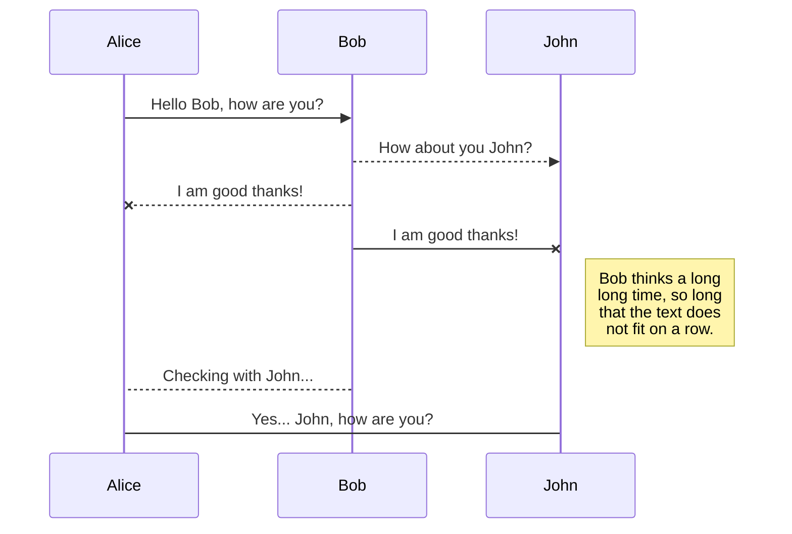

# Welcome to StackEdit!

Hi! I'm your first Markdown file in **StackEdit**. If you want to learn about StackEdit, you can read me. If you want to play with Markdown, you can edit me. Once you have finished with me, you can create new files by opening the **file explorer** on the left corner of the navigation bar.


# Files

StackEdit stores your files in your browser, which means all your files are automatically saved locally and are accessible **offline!**

## Create files and folders

The file explorer is accessible using the button in left corner of the navigation bar. You can create a new file by clicking the **New file** button in the file explorer. You can also create folders by clicking the **New folder** button.

## Switch to another file

All your files are listed in the file explorer. You can switch from one to another by clicking a file in the list.

## Rename a file

You can rename the current file by clicking the file name in the navigation bar or by clicking the **Rename** button in the file explorer.

## Delete a file

You can delete the current file by clicking the **Remove** button in the file explorer. The file will be moved into the **Trash** folder and automatically deleted after 7 days of inactivity.

## Export a file

You can export the current file by clicking **Export to disk** in the menu. You can choose to export the file as plain Markdown, as HTML using a Handlebars template or as a PDF.


# Synchronization

Synchronization is one of the biggest features of StackEdit. It enables you to synchronize any file in your workspace with other files stored in your **Google Drive**, your **Dropbox** and your **GitHub** accounts. This allows you to keep writing on other devices, collaborate with people you share the file with, integrate easily into your workflow... The synchronization mechanism takes place every minute in the background, downloading, merging, and uploading file modifications.

There are two types of synchronization and they can complement each other:

- The workspace synchronization will sync all your files, folders and settings automatically. This will allow you to fetch your workspace on any other device.
	> To start syncing your workspace, just sign in with Google in the menu.

- The file synchronization will keep one file of the workspace synced with one or multiple files in **Google Drive**, **Dropbox** or **GitHub**.
	> Before starting to sync files, you must link an account in the **Synchronize** sub-menu.

## Open a file

You can open a file from **Google Drive**, **Dropbox** or **GitHub** by opening the **Synchronize** sub-menu and clicking **Open from**. Once opened in the workspace, any modification in the file will be automatically synced.

## Save a file

You can save any file of the workspace to **Google Drive**, **Dropbox** or **GitHub** by opening the **Synchronize** sub-menu and clicking **Save on**. Even if a file in the workspace is already synced, you can save it to another location. StackEdit can sync one file with multiple locations and accounts.

## Synchronize a file

Once your file is linked to a synchronized location, StackEdit will periodically synchronize it by downloading/uploading any modification. A merge will be performed if necessary and conflicts will be resolved.

If you just have modified your file and you want to force syncing, click the **Synchronize now** button in the navigation bar.

> **Note:** The **Synchronize now** button is disabled if you have no file to synchronize.

## Manage file synchronization

Since one file can be synced with multiple locations, you can list and manage synchronized locations by clicking **File synchronization** in the **Synchronize** sub-menu. This allows you to list and remove synchronized locations that are linked to your file.


# Publication

Publishing in StackEdit makes it simple for you to publish online your files. Once you're happy with a file, you can publish it to different hosting platforms like **Blogger**, **Dropbox**, **Gist**, **GitHub**, **Google Drive**, **WordPress** and **Zendesk**. With [Handlebars templates](http://handlebarsjs.com/), you have full control over what you export.

> Before starting to publish, you must link an account in the **Publish** sub-menu.

## Publish a File

You can publish your file by opening the **Publish** sub-menu and by clicking **Publish to**. For some locations, you can choose between the following formats:

- Markdown: publish the Markdown text on a website that can interpret it (**GitHub** for instance),
- HTML: publish the file converted to HTML via a Handlebars template (on a blog for example).

## Update a publication

After publishing, StackEdit keeps your file linked to that publication which makes it easy for you to re-publish it. Once you have modified your file and you want to update your publication, click on the **Publish now** button in the navigation bar.

> **Note:** The **Publish now** button is disabled if your file has not been published yet.

## Manage file publication

Since one file can be published to multiple locations, you can list and manage publish locations by clicking **File publication** in the **Publish** sub-menu. This allows you to list and remove publication locations that are linked to your file.


# Markdown extensions

StackEdit extends the standard Markdown syntax by adding extra **Markdown extensions**, providing you with some nice features.

> **ProTip:** You can disable any **Markdown extension** in the **File properties** dialog.


## SmartyPants

SmartyPants converts ASCII punctuation characters into "smart" typographic punctuation HTML entities. For example:

|                |ASCII                          |HTML                         |
|----------------|-------------------------------|-----------------------------|
|Single backticks|`'Isn't this fun?'`            |'Isn't this fun?'            |
|Quotes          |`"Isn't this fun?"`            |"Isn't this fun?"            |
|Dashes          |`-- is en-dash, --- is em-dash`|-- is en-dash, --- is em-dash|


## KaTeX

You can render LaTeX mathematical expressions using [KaTeX](https://khan.github.io/KaTeX/):

The *Gamma function* satisfying $\Gamma(n) = (n-1)!\quad\forall n\in\mathbb N$ is via the Euler integral

$$
\Gamma(z) = \int_0^\infty t^{z-1}e^{-t}dt\,.
$$

> You can find more information about **LaTeX** mathematical expressions [here](http://meta.math.stackexchange.com/questions/5020/mathjax-basic-tutorial-and-quick-reference).


## UML diagrams

You can render UML diagrams using [Mermaid](https://mermaidjs.github.io/). For example, this will produce a sequence diagram:



And this will produce a flow chart:

```mermaid
graph LR
A[Square Rect] -- Link text --> B((Circle))
A --> C(Round Rect)
B --> D{Rhombus}
C --> D
```---


---

<h1 id="welcome-to-stackedit">Welcome to StackEdit!</h1>
<p>Hi! I’m your first Markdown file in <strong>StackEdit</strong>. If you want to learn about StackEdit, you can read me. If you want to play with Markdown, you can edit me. Once you have finished with me, you can create new files by opening the <strong>file explorer</strong> on the left corner of the navigation bar.</p>
<h1 id="files">Files</h1>
<p>StackEdit stores your files in your browser, which means all your files are automatically saved locally and are accessible <strong>offline!</strong></p>
<h2 id="create-files-and-folders">Create files and folders</h2>
<p>The file explorer is accessible using the button in left corner of the navigation bar. You can create a new file by clicking the <strong>New file</strong> button in the file explorer. You can also create folders by clicking the <strong>New folder</strong> button.</p>
<h2 id="switch-to-another-file">Switch to another file</h2>
<p>All your files are listed in the file explorer. You can switch from one to another by clicking a file in the list.</p>
<h2 id="rename-a-file">Rename a file</h2>
<p>You can rename the current file by clicking the file name in the navigation bar or by clicking the <strong>Rename</strong> button in the file explorer.</p>
<h2 id="delete-a-file">Delete a file</h2>
<p>You can delete the current file by clicking the <strong>Remove</strong> button in the file explorer. The file will be moved into the <strong>Trash</strong> folder and automatically deleted after 7 days of inactivity.</p>
<h2 id="export-a-file">Export a file</h2>
<p>You can export the current file by clicking <strong>Export to disk</strong> in the menu. You can choose to export the file as plain Markdown, as HTML using a Handlebars template or as a PDF.</p>
<h1 id="synchronization">Synchronization</h1>
<p>Synchronization is one of the biggest features of StackEdit. It enables you to synchronize any file in your workspace with other files stored in your <strong>Google Drive</strong>, your <strong>Dropbox</strong> and your <strong>GitHub</strong> accounts. This allows you to keep writing on other devices, collaborate with people you share the file with, integrate easily into your workflow… The synchronization mechanism takes place every minute in the background, downloading, merging, and uploading file modifications.</p>
<p>There are two types of synchronization and they can complement each other:</p>
<ul>
<li>
<p>The workspace synchronization will sync all your files, folders and settings automatically. This will allow you to fetch your workspace on any other device.</p>
<blockquote>
<p>To start syncing your workspace, just sign in with Google in the menu.</p>
</blockquote>
</li>
<li>
<p>The file synchronization will keep one file of the workspace synced with one or multiple files in <strong>Google Drive</strong>, <strong>Dropbox</strong> or <strong>GitHub</strong>.</p>
<blockquote>
<p>Before starting to sync files, you must link an account in the <strong>Synchronize</strong> sub-menu.</p>
</blockquote>
</li>
</ul>
<h2 id="open-a-file">Open a file</h2>
<p>You can open a file from <strong>Google Drive</strong>, <strong>Dropbox</strong> or <strong>GitHub</strong> by opening the <strong>Synchronize</strong> sub-menu and clicking <strong>Open from</strong>. Once opened in the workspace, any modification in the file will be automatically synced.</p>
<h2 id="save-a-file">Save a file</h2>
<p>You can save any file of the workspace to <strong>Google Drive</strong>, <strong>Dropbox</strong> or <strong>GitHub</strong> by opening the <strong>Synchronize</strong> sub-menu and clicking <strong>Save on</strong>. Even if a file in the workspace is already synced, you can save it to another location. StackEdit can sync one file with multiple locations and accounts.</p>
<h2 id="synchronize-a-file">Synchronize a file</h2>
<p>Once your file is linked to a synchronized location, StackEdit will periodically synchronize it by downloading/uploading any modification. A merge will be performed if necessary and conflicts will be resolved.</p>
<p>If you just have modified your file and you want to force syncing, click the <strong>Synchronize now</strong> button in the navigation bar.</p>
<blockquote>
<p><strong>Note:</strong> The <strong>Synchronize now</strong> button is disabled if you have no file to synchronize.</p>
</blockquote>
<h2 id="manage-file-synchronization">Manage file synchronization</h2>
<p>Since one file can be synced with multiple locations, you can list and manage synchronized locations by clicking <strong>File synchronization</strong> in the <strong>Synchronize</strong> sub-menu. This allows you to list and remove synchronized locations that are linked to your file.</p>
<h1 id="publication">Publication</h1>
<p>Publishing in StackEdit makes it simple for you to publish online your files. Once you’re happy with a file, you can publish it to different hosting platforms like <strong>Blogger</strong>, <strong>Dropbox</strong>, <strong>Gist</strong>, <strong>GitHub</strong>, <strong>Google Drive</strong>, <strong>WordPress</strong> and <strong>Zendesk</strong>. With <a href="http://handlebarsjs.com/">Handlebars templates</a>, you have full control over what you export.</p>
<blockquote>
<p>Before starting to publish, you must link an account in the <strong>Publish</strong> sub-menu.</p>
</blockquote>
<h2 id="publish-a-file">Publish a File</h2>
<p>You can publish your file by opening the <strong>Publish</strong> sub-menu and by clicking <strong>Publish to</strong>. For some locations, you can choose between the following formats:</p>
<ul>
<li>Markdown: publish the Markdown text on a website that can interpret it (<strong>GitHub</strong> for instance),</li>
<li>HTML: publish the file converted to HTML via a Handlebars template (on a blog for example).</li>
</ul>
<h2 id="update-a-publication">Update a publication</h2>
<p>After publishing, StackEdit keeps your file linked to that publication which makes it easy for you to re-publish it. Once you have modified your file and you want to update your publication, click on the <strong>Publish now</strong> button in the navigation bar.</p>
<blockquote>
<p><strong>Note:</strong> The <strong>Publish now</strong> button is disabled if your file has not been published yet.</p>
</blockquote>
<h2 id="manage-file-publication">Manage file publication</h2>
<p>Since one file can be published to multiple locations, you can list and manage publish locations by clicking <strong>File publication</strong> in the <strong>Publish</strong> sub-menu. This allows you to list and remove publication locations that are linked to your file.</p>
<h1 id="markdown-extensions">Markdown extensions</h1>
<p>StackEdit extends the standard Markdown syntax by adding extra <strong>Markdown extensions</strong>, providing you with some nice features.</p>
<blockquote>
<p><strong>ProTip:</strong> You can disable any <strong>Markdown extension</strong> in the <strong>File properties</strong> dialog.</p>
</blockquote>
<h2 id="smartypants">SmartyPants</h2>
<p>SmartyPants converts ASCII punctuation characters into “smart” typographic punctuation HTML entities. For example:</p>

<table>
<thead>
<tr>
<th></th>
<th>ASCII</th>
<th>HTML</th>
</tr>
</thead>
<tbody>
<tr>
<td>Single backticks</td>
<td><code>'Isn't this fun?'</code></td>
<td>‘Isn’t this fun?’</td>
</tr>
<tr>
<td>Quotes</td>
<td><code>"Isn't this fun?"</code></td>
<td>“Isn’t this fun?”</td>
</tr>
<tr>
<td>Dashes</td>
<td><code>-- is en-dash, --- is em-dash</code></td>
<td>– is en-dash, — is em-dash</td>
</tr>
</tbody>
</table><h2 id="katex">KaTeX</h2>
<p>You can render LaTeX mathematical expressions using <a href="https://khan.github.io/KaTeX/">KaTeX</a>:</p>
<p>The <em>Gamma function</em> satisfying <span class="katex--inline"><span class="katex"><span class="katex-mathml"><math><semantics><mrow><mi mathvariant="normal">Γ</mi><mo>(</mo><mi>n</mi><mo>)</mo><mo>=</mo><mo>(</mo><mi>n</mi><mo>−</mo><mn>1</mn><mo>)</mo><mo>!</mo><mspace width="1em"></mspace><mi mathvariant="normal">∀</mi><mi>n</mi><mo>∈</mo><mi mathvariant="double-struck">N</mi></mrow><annotation encoding="application/x-tex">\Gamma(n) = (n-1)!\quad\forall n\in\mathbb N</annotation></semantics></math></span><span class="katex-html" aria-hidden="true"><span class="strut" style="height: 0.75em;"></span><span class="strut bottom" style="height: 1em; vertical-align: -0.25em;"></span><span class="base"><span class="mord">Γ</span><span class="mopen">(</span><span class="mord mathit">n</span><span class="mclose">)</span><span class="mord rule" style="margin-right: 0.277778em;"></span><span class="mrel">=</span><span class="mord rule" style="margin-right: 0.277778em;"></span><span class="mopen">(</span><span class="mord mathit">n</span><span class="mord rule" style="margin-right: 0.222222em;"></span><span class="mbin">−</span><span class="mord rule" style="margin-right: 0.222222em;"></span><span class="mord">1</span><span class="mclose">)</span><span class="mclose">!</span><span class="mspace quad"></span><span class="mord">∀</span><span class="mord mathit">n</span><span class="mord rule" style="margin-right: 0.277778em;"></span><span class="mrel">∈</span><span class="mord rule" style="margin-right: 0.277778em;"></span><span class="mord mathbb">N</span></span></span></span></span> is via the Euler integral</p>
<p><span class="katex--display"><span class="katex-display"><span class="katex"><span class="katex-mathml"><math><semantics><mrow><mi mathvariant="normal">Γ</mi><mo>(</mo><mi>z</mi><mo>)</mo><mo>=</mo><msubsup><mo>∫</mo><mn>0</mn><mi mathvariant="normal">∞</mi></msubsup><msup><mi>t</mi><mrow><mi>z</mi><mo>−</mo><mn>1</mn></mrow></msup><msup><mi>e</mi><mrow><mo>−</mo><mi>t</mi></mrow></msup><mi>d</mi><mi>t</mi><mspace width="0.16667em"></mspace><mi mathvariant="normal">.</mi></mrow><annotation encoding="application/x-tex">
\Gamma(z) = \int_0^\infty t^{z-1}e^{-t}dt\,.
</annotation></semantics></math></span><span class="katex-html" aria-hidden="true"><span class="strut" style="height: 1.41429em;"></span><span class="strut bottom" style="height: 2.32624em; vertical-align: -0.91195em;"></span><span class="base"><span class="mord">Γ</span><span class="mopen">(</span><span class="mord mathit" style="margin-right: 0.04398em;">z</span><span class="mclose">)</span><span class="mord rule" style="margin-right: 0.277778em;"></span><span class="mrel">=</span><span class="mord rule" style="margin-right: 0.277778em;"></span><span class="mop"><span class="mop op-symbol large-op" style="margin-right: 0.44445em; position: relative; top: -0.001125em;">∫</span><span class="msupsub"><span class="vlist-t vlist-t2"><span class="vlist-r"><span class="vlist" style="height: 1.41429em;"><span class="" style="top: -1.78805em; margin-left: -0.44445em; margin-right: 0.05em;"><span class="pstrut" style="height: 2.7em;"></span><span class="sizing reset-size6 size3 mtight"><span class="mord mtight">0</span></span></span><span class="" style="top: -3.8129em; margin-right: 0.05em;"><span class="pstrut" style="height: 2.7em;"></span><span class="sizing reset-size6 size3 mtight"><span class="mord mtight">∞</span></span></span></span><span class="vlist-s">​</span></span><span class="vlist-r"><span class="vlist" style="height: 0.91195em;"></span></span></span></span></span><span class="mord rule" style="margin-right: 0.166667em;"></span><span class="mord"><span class="mord mathit">t</span><span class="msupsub"><span class="vlist-t"><span class="vlist-r"><span class="vlist" style="height: 0.864108em;"><span class="" style="top: -3.113em; margin-right: 0.05em;"><span class="pstrut" style="height: 2.7em;"></span><span class="sizing reset-size6 size3 mtight"><span class="mord mtight"><span class="mord mathit mtight" style="margin-right: 0.04398em;">z</span><span class="mbin mtight">−</span><span class="mord mtight">1</span></span></span></span></span></span></span></span></span><span class="mord"><span class="mord mathit">e</span><span class="msupsub"><span class="vlist-t"><span class="vlist-r"><span class="vlist" style="height: 0.843556em;"><span class="" style="top: -3.113em; margin-right: 0.05em;"><span class="pstrut" style="height: 2.7em;"></span><span class="sizing reset-size6 size3 mtight"><span class="mord mtight"><span class="mord mtight">−</span><span class="mord mathit mtight">t</span></span></span></span></span></span></span></span></span><span class="mord mathit">d</span><span class="mord mathit">t</span><span class="mspace thinspace"></span><span class="mord">.</span></span></span></span></span></span></p>
<blockquote>
<p>You can find more information about <strong>LaTeX</strong> mathematical expressions <a href="http://meta.math.stackexchange.com/questions/5020/mathjax-basic-tutorial-and-quick-reference">here</a>.</p>
</blockquote>
<h2 id="uml-diagrams">UML diagrams</h2>
<p>You can render UML diagrams using <a href="https://mermaidjs.github.io/">Mermaid</a>. For example, this will produce a sequence diagram:</p>
<div class="mermaid"><svg xmlns="http://www.w3.org/2000/svg" id="mermaid-svg-R7Zy0kmcnqSKwIfi" height="100%" width="100%" style="max-width:750px;" viewBox="-50 -10 750 483.59375"><g></g><g><line id="actor3" x1="75" y1="5" x2="75" y2="472.59375" class="actor-line" stroke-width="0.5px" stroke="#999"></line><rect x="0" y="0" fill="#eaeaea" stroke="#666" width="150" height="65" rx="3" ry="3" class="actor"></rect><text x="75" y="32.5" dominant-baseline="central" alignment-baseline="central" class="actor" style="text-anchor: middle;"><tspan x="75" dy="0">Alice</tspan></text></g><g><line id="actor4" x1="275" y1="5" x2="275" y2="472.59375" class="actor-line" stroke-width="0.5px" stroke="#999"></line><rect x="200" y="0" fill="#eaeaea" stroke="#666" width="150" height="65" rx="3" ry="3" class="actor"></rect><text x="275" y="32.5" dominant-baseline="central" alignment-baseline="central" class="actor" style="text-anchor: middle;"><tspan x="275" dy="0">Bob</tspan></text></g><g><line id="actor5" x1="475" y1="5" x2="475" y2="472.59375" class="actor-line" stroke-width="0.5px" stroke="#999"></line><rect x="400" y="0" fill="#eaeaea" stroke="#666" width="150" height="65" rx="3" ry="3" class="actor"></rect><text x="475" y="32.5" dominant-baseline="central" alignment-baseline="central" class="actor" style="text-anchor: middle;"><tspan x="475" dy="0">John</tspan></text></g><defs><marker id="arrowhead" refX="5" refY="2" markerWidth="6" markerHeight="4" orient="auto"><path d="M 0,0 V 4 L6,2 Z"></path></marker></defs><defs><marker id="crosshead" markerWidth="15" markerHeight="8" orient="auto" refX="16" refY="4"><path fill="black" stroke="#000000" stroke-width="1px" d="M 9,2 V 6 L16,4 Z" style="stroke-dasharray: 0, 0;"></path><path fill="none" stroke="#000000" stroke-width="1px" d="M 0,1 L 6,7 M 6,1 L 0,7" style="stroke-dasharray: 0, 0;"></path></marker></defs><g><text x="175" y="93" class="messageText" style="text-anchor: middle;">Hello Bob, how are you?</text><line x1="75" y1="100" x2="275" y2="100" class="messageLine0" stroke-width="2" stroke="black" marker-end="url(#arrowhead)" style="fill: none;"></line></g><g><text x="375" y="128" class="messageText" style="text-anchor: middle;">How about you John?</text><line x1="275" y1="135" x2="475" y2="135" class="messageLine1" stroke-width="2" stroke="black" marker-end="url(#arrowhead)" style="stroke-dasharray: 3, 3; fill: none;"></line></g><g><text x="175" y="163" class="messageText" style="text-anchor: middle;">I am good thanks!</text><line x1="275" y1="170" x2="75" y2="170" class="messageLine1" stroke-width="2" stroke="black" marker-end="url(#crosshead)" style="stroke-dasharray: 3, 3; fill: none;"></line></g><g><text x="375" y="198" class="messageText" style="text-anchor: middle;">I am good thanks!</text><line x1="275" y1="205" x2="475" y2="205" class="messageLine0" stroke-width="2" stroke="black" marker-end="url(#crosshead)" style="fill: none;"></line></g><g><rect x="500" y="215" fill="#EDF2AE" stroke="#666" width="150" height="102.59375" rx="0" ry="0" class="note"></rect><text x="516" y="245" fill="black" class="noteText"><tspan x="516">Bob thinks a long</tspan><tspan dy="23" x="516">long time, so long</tspan><tspan dy="23" x="516">that the text does</tspan><tspan dy="23" x="516">not fit on a row.</tspan></text></g><g><text x="175" y="345.59375" class="messageText" style="text-anchor: middle;">Checking with John...</text><line x1="275" y1="352.59375" x2="75" y2="352.59375" class="messageLine1" stroke-width="2" stroke="black" style="stroke-dasharray: 3, 3; fill: none;"></line></g><g><text x="275" y="380.59375" class="messageText" style="text-anchor: middle;">Yes... John, how are you?</text><line x1="75" y1="387.59375" x2="475" y2="387.59375" class="messageLine0" stroke-width="2" stroke="black" style="fill: none;"></line></g><g><rect x="0" y="407.59375" fill="#eaeaea" stroke="#666" width="150" height="65" rx="3" ry="3" class="actor"></rect><text x="75" y="440.09375" dominant-baseline="central" alignment-baseline="central" class="actor" style="text-anchor: middle;"><tspan x="75" dy="0">Alice</tspan></text></g><g><rect x="200" y="407.59375" fill="#eaeaea" stroke="#666" width="150" height="65" rx="3" ry="3" class="actor"></rect><text x="275" y="440.09375" dominant-baseline="central" alignment-baseline="central" class="actor" style="text-anchor: middle;"><tspan x="275" dy="0">Bob</tspan></text></g><g><rect x="400" y="407.59375" fill="#eaeaea" stroke="#666" width="150" height="65" rx="3" ry="3" class="actor"></rect><text x="475" y="440.09375" dominant-baseline="central" alignment-baseline="central" class="actor" style="text-anchor: middle;"><tspan x="475" dy="0">John</tspan></text></g></svg></div>
<p>And this will produce a flow chart:</p>
<div class="mermaid"><svg xmlns="http://www.w3.org/2000/svg" id="mermaid-svg-QbtPbMbuC00lPdPe" height="100%" viewBox="0 0 605.8874969482422 232.359375" style="max-width:605.8874969482422px;"><g><g class="output"><g class="clusters"></g><g class="edgePaths"><g class="edgePath" style="opacity: 1;"><path class="path" d="M141.65692249754056,84.26953125L207.890625,54.9296875L296.5625,54.9296875" marker-end="url(#arrowhead33)" style="fill:none"></path><defs><marker id="arrowhead33" viewBox="0 0 10 10" refX="9" refY="5" markerUnits="strokeWidth" markerWidth="8" markerHeight="6" orient="auto"><path d="M 0 0 L 10 5 L 0 10 z" class="arrowheadPath" style="stroke-width: 1; stroke-dasharray: 1, 0;"></path></marker></defs></g><g class="edgePath" style="opacity: 1;"><path class="path" d="M141.65692249754056,136.76953125L207.890625,166.109375L270.984375,166.109375" marker-end="url(#arrowhead34)" style="fill:none"></path><defs><marker id="arrowhead34" viewBox="0 0 10 10" refX="9" refY="5" markerUnits="strokeWidth" markerWidth="8" markerHeight="6" orient="auto"><path d="M 0 0 L 10 5 L 0 10 z" class="arrowheadPath" style="stroke-width: 1; stroke-dasharray: 1, 0;"></path></marker></defs></g><g class="edgePath" style="opacity: 1;"><path class="path" d="M366.421875,54.9296875L417,54.9296875L466.6588202324742,86.86071254340472" marker-end="url(#arrowhead35)" style="fill:none"></path><defs><marker id="arrowhead35" viewBox="0 0 10 10" refX="9" refY="5" markerUnits="strokeWidth" markerWidth="8" markerHeight="6" orient="auto"><path d="M 0 0 L 10 5 L 0 10 z" class="arrowheadPath" style="stroke-width: 1; stroke-dasharray: 1, 0;"></path></marker></defs></g><g class="edgePath" style="opacity: 1;"><path class="path" d="M392,166.109375L417,166.109375L466.65881837093923,135.17835114681816" marker-end="url(#arrowhead36)" style="fill:none"></path><defs><marker id="arrowhead36" viewBox="0 0 10 10" refX="9" refY="5" markerUnits="strokeWidth" markerWidth="8" markerHeight="6" orient="auto"><path d="M 0 0 L 10 5 L 0 10 z" class="arrowheadPath" style="stroke-width: 1; stroke-dasharray: 1, 0;"></path></marker></defs></g></g><g class="edgeLabels"><g class="edgeLabel" transform="translate(207.890625,54.9296875)" style="opacity: 1;"><g transform="translate(-38.09375,-16.25)" class="label"><foreignObject width="76.19140625" height="32.5"><div xmlns="http://www.w3.org/1999/xhtml" style="display: inline-block; white-space: nowrap;"><span class="edgeLabel">Link text</span></div></foreignObject></g></g><g class="edgeLabel" transform="" style="opacity: 1;"><g transform="translate(0,0)" class="label"><foreignObject width="0" height="0"><div xmlns="http://www.w3.org/1999/xhtml" style="display: inline-block; white-space: nowrap;"><span class="edgeLabel"></span></div></foreignObject></g></g><g class="edgeLabel" transform="" style="opacity: 1;"><g transform="translate(0,0)" class="label"><foreignObject width="0" height="0"><div xmlns="http://www.w3.org/1999/xhtml" style="display: inline-block; white-space: nowrap;"><span class="edgeLabel"></span></div></foreignObject></g></g><g class="edgeLabel" transform="" style="opacity: 1;"><g transform="translate(0,0)" class="label"><foreignObject width="0" height="0"><div xmlns="http://www.w3.org/1999/xhtml" style="display: inline-block; white-space: nowrap;"><span class="edgeLabel"></span></div></foreignObject></g></g></g><g class="nodes"><g class="node" id="A" transform="translate(82.3984375,110.51953125)" style="opacity: 1;"><rect rx="0" ry="0" x="-62.3984375" y="-26.25" width="124.796875" height="52.5"></rect><g class="label" transform="translate(0,0)"><g transform="translate(-52.3984375,-16.25)"><foreignObject width="104.8046875" height="32.5"><div xmlns="http://www.w3.org/1999/xhtml" style="display: inline-block; white-space: nowrap;">Square Rect</div></foreignObject></g></g></g><g class="node" style="opacity: 1;" id="B" transform="translate(331.4921875,54.9296875)"><circle x="-34.9296875" y="-26.25" r="34.9296875"></circle><g class="label" transform="translate(0,0)"><g transform="translate(-24.9296875,-16.25)"><foreignObject width="49.86328125" height="32.5"><div xmlns="http://www.w3.org/1999/xhtml" style="display: inline-block; white-space: nowrap;">Circle</div></foreignObject></g></g></g><g class="node" style="opacity: 1;" id="C" transform="translate(331.4921875,166.109375)"><rect rx="5" ry="5" x="-60.5078125" y="-26.25" width="121.015625" height="52.5"></rect><g class="label" transform="translate(0,0)"><g transform="translate(-50.5078125,-16.25)"><foreignObject width="101.015625" height="32.5"><div xmlns="http://www.w3.org/1999/xhtml" style="display: inline-block; white-space: nowrap;">Round Rect</div></foreignObject></g></g></g><g class="node" style="opacity: 1;" id="D" transform="translate(503.9437484741211,110.51953125)"><polygon points="61.94375,0 123.8875,-61.94375 61.94375,-123.8875 0,-61.94375" rx="5" ry="5" transform="translate(-61.94375,61.94375)"></polygon><g class="label" transform="translate(0,0)"><g transform="translate(-41.1796875,-16.25)"><foreignObject width="82.36328125" height="32.5"><div xmlns="http://www.w3.org/1999/xhtml" style="display: inline-block; white-space: nowrap;">Rhombus</div></foreignObject></g></g></g></g></g></g></svg></div>
<!DOCTYPE html>
<html>

<head>
  <meta charset="utf-8">
  <meta name="viewport" content="width=device-width, initial-scale=1.0">
  <link rel="stylesheet" href="https://stackedit.io/style.css" />
</head>

<body class="stackedit">
  <div class="stackedit__html"><h1 id="adel-framework">ADEL Framework</h1>
<h2 id="app-development-easy-library">App Development Easy Library</h2>
<p>Mobile app development using web technologies such as html/css with cordova comes with a lot of advantages, but a lot of struggles too.</p>
<p>Handling complicated routes system or dealing with complex and huge frameworks such as Angular or React while developping a small app are common troubles that may disuade you from trying to make your own mobile application.</p>
<p>That’s where the <strong>ADEL Framework</strong> can help you.</p>
<h2 id="advantages">Advantages</h2>
<p>If you are familiar to regular web development but not confortable with Angular, View or React development, the <strong>ADEL Framework</strong> is made for you.</p>
<ul>
<li>
<p><strong>Easy to set up</strong> just <a href="https://github.com/thomasdqr/ADEL-Framework/archive/master.zip">download</a> the library, extract the zip and you’re good to go.</p>
</li>
<li>
<p>Can be <strong>integrated to an existing project</strong> in just few steps.</p>
</li>
<li>
<p><strong>Lightweight</strong> the library is very light and easy to modify.</p>
</li>
<li>
<p><strong>Flexible</strong> so that it can fit any kind of app.</p>
</li>
</ul>
<h2 id="features">Features</h2>
<p>ADEL Framework provides <strong>dead simple navigation</strong> between pages using very natural code.</p>
<p>The library also provides a <strong>clean architecture</strong> for your project, helping you structuring your files.</p>
<p>ADEL is made to work perfectly in an <strong>Apache Cordova</strong> or <strong>Phonegap</strong> environment.</p>
<p>The Library is meant to be used for <strong>SPA</strong> (Simple Page Application) with features like preloading all the views at start.</p>
<p>Finally a <strong>complete navigation bar system</strong> is available with easy customisable pure css options.</p>
<h2 id="how-to-get-started">How to get started</h2>
<h3 id="installation">Installation</h3>
<p>Download and extract the linked project.<br>
Open the folder in your favourite IDE.</p>
<h3 id="architecture">Architecture</h3>
<p>Here is the default project architecture</p>
<p><br>
<em>ADEL Architecure</em></p>
<p>The <strong>library folder</strong> contains all the ADEL Framework files, it should never been modified.<br>
The <strong>pages folder</strong> contains all your pages converted in views by the framework at runtime, it’s here that you will create all the different panels of your app.<br>
The <strong>index.html</strong> is the main page of your app where the differents views are being showed and where the Framework is imported, edit this file to customize your navigation bar.<br>
Finally <strong>setup.js</strong> is an example .js file loaded in index.html to demonstrate how to load and use basic functionnalities of the <strong>App Development Easy Library</strong>.</p>
<h3 id="basic-setup">Basic setup</h3>
<p>The way the library work is simple. The index.html is divided in two parts. The main part, showing the differents views (or pages as you can call it) and the navigation bar at the bottom if you choose to show one.</p>
<p><br>
<em>index.html layout</em></p>
<p>After extracting the library, open the folder in your favourite IDE.<br>
Load index.html file. You can see the two parts we talked about here :</p>
<pre><code>&lt;body&gt;
&lt;adel-main&gt;&lt;/adel-main&gt;
&lt;adel-navbar&gt;&lt;/adel-navbar&gt;
&lt;/body&gt;
</code></pre>
<p>Leave the adel-main empty as it will be completely handled by the framework.<br>
We will see how to use the navigation bar div in the next parts.</p>
<p>One important thing to note, is that ADEL is using Jquery framework to work and optimise differents actions, that’s why you can find it imported in the head part of index.html.</p>
<p>Finally you can locate the laoding of ADEL in the bottom of the file as well as the default setup.js file.</p>
<pre><code>&lt;script src="library/adel.js"&gt;&lt;/script&gt;
&lt;script src="setup.js"&gt;&lt;/script&gt;
</code></pre>
<h3 id="using-the-framework">Using the Framework</h3>
<p>Start by creating multiple pages that we are going to use for our app.<br>
Put it in the <strong>pages folder</strong> and named them clearly, in this example we will call them page1.html and page2.html.<br>
Let’s jump to the <strong>setup.js</strong> file to start using ADEL.</p>
<p>The first thing to do is to declare a new app</p>
<pre><code>// Declare our app using ADEL.js framework
var app = new ADEL();
</code></pre>
<p>Our newly created app has a lot of differents parameters that you can learn about in the <a href="https://github.com/thomasdqr/ADEL-Framework#app-parameters">App parameters</a> section.</p>
<p>One of the main component of our app is the Navigation Controller, as its name stands, it will handle all the navigation between our different views.<br>
The only thing we need to do to set it up is the following line</p>
<pre><code>app.navController.Init(["page1.html", "page2.html");
</code></pre>
<p>Here we have told our Navigation Controller what are our different pages. Everytime you add a new page to your app, just add a new element to the array sent here.</p>
<p>If you now load your app, you will see the page1.html sucessfully loaded.</p>
<h3 id="navigation-bar">Navigation bar</h3>
<p>Now let’s add a simple navigation bar to navigate through our pages.<br>
Remember our app has different parameters. One of them define if we want to use a navigation bar or not.</p>
<p>To enable navigation bar use the following parameter</p>
<pre><code>app.params.useNavBar = true;
</code></pre>
<p><strong>Important to note :<br>
Every parameters have to be set before Navigation controller Init() function</strong></p>
<p>As you can see, an empty bottom bar has appeared. Now we need to define our different buttons.<br>
(The navigation bar style can be directly edited in Adel.css or by adding your own custom css rules to index.html)</p>
<p>To add buttons to the bar, just add adel-navbtn elements to the adel-navbar like so</p>
<pre><code>&lt;adel-navbar&gt;
	&lt;adel-navbtn goToPage="0"&gt;&lt;/adel-navbtn&gt;
	&lt;adel-navbtn goToPage="1"&gt;&lt;/adel-navbtn&gt;
&lt;/adel-navbar&gt;
</code></pre>
<p>The goToPage attribute define wich page is related to the button.<br>
Here :<br>
0 -&gt; page1.html<br>
1 -&gt; page2.html<br>
The order coresponding to the Navigation Controller Init() function declared precedently.</p>
<p>Once this is done, we have two zones in our navigation bar leading to page 1 and page 2 when clicked. But there are still empty as adel-navbtn are only used for logic, not styling.</p>
<p>To style our buttons, we can add whatever html component we want, div / label / button / img / etc…</p>
<p>For this example let’s use buttons</p>
<pre><code>&lt;adel-navbar&gt;
	&lt;adel-navbtn goToPage="0"&gt;
		&lt;button adel-navicon&gt;Page 1&lt;/button&gt;
	&lt;/adel-navbtn&gt;
	&lt;adel-navbtn goToPage="1"&gt;
		&lt;button adel-navicon&gt;Page 2&lt;/button&gt;
	&lt;/adel-navbtn&gt;
&lt;/adel-navbar&gt;
</code></pre>
<p>As you can note, we added the attribute <strong>adel-navIcon</strong> to the button. This way we can add interactive style to these elements.</p>
<p>First let’s make those buttons a bit better with basic styling. You can add inline css or just link a custom css file to index.html (Directly modifying Adel.css file is not recommanded)</p>
<pre><code>/* add this css to a new css sheet and link it to index.html */

button
{
width : 100%;
height: 100%;
border-style: none;
}
</code></pre>
<p>Now we have two visible buttons to switch between our pages.</p>
<p>Finally, let’s use the adel-navicon attribute and the ADEL Framework built-in style functions to make those buttons react to page navigation.</p>
<p>Using the library, we can define style for inactive and active button.</p>
<p>To do this add the following parameters to our app</p>
<pre><code>// Define navbar icons highlight style 
app.params.navBarActiveStyle = {
    "background-color": "dodgerblue",
};
app.params.navBarInactiveStyle = {
	"background-color": "grey",
};
</code></pre>
<p>Refresh the app, and now the button navicon highlight in blue when active.</p>
<p>You can try adding more pages and play with parameters to make the app your own.</p>
<p>Final setup.js</p>
<pre><code>// Declare our app using ADEL.js framework
var app = new ADEL();

// Enabling navigation bar;
app.params.useNavBar = true;

// Define navbar icons highlight style
app.params.navBarActiveStyle = {
	"background-color": "dodgerblue",
};
app.params.navBarInactiveStyle = {
	"background-color": "grey",	
};

// Initialise our pages
app.navController.Init(["page1.html", "page2.html"]);
</code></pre>
<h3 id="additional-functions">Additional functions</h3>
<p>You can also use manual navigation at anytime using the GoToPage(pageIndex) function.</p>
<p>Here an example using Jquery</p>
<pre><code>// Example of manual navigation
$("#home_btn").click(function() {
	app.navController.GoToPage(0);
});
$("#about_btn").click(function() {
	app.navController.GoToPage(1);
});
</code></pre>
<p>You can also choose to Hide or Show the navigation bar at any moment using functions.</p>
<pre><code>// Hide and Show Navigation Bar
app.navController.HideNavBar()
app.navController.ShowNavBar()
</code></pre>
<h2 id="app-parameters">App parameters</h2>
<ul>
<li>
<p><strong>loadAllAtStart</strong><br>
All the pages are preloaded at the start of the app, slower loading but faster transitions between pages.</p>
<pre><code>// Load all at start (by default : false)
app.params.loadAllAtStart= true
</code></pre>
</li>
<li>
<p><strong>defaultIndex</strong><br>
Define the starting page index to load when app is started</p>
<pre><code>// Default index (by default : 0)
app.params.defaultIndex = 2
</code></pre>
</li>
<li>
<p><strong>useNavBar</strong><br>
Does the app use navigation bar or not</p>
<pre><code>// Use navigation bar (by default : false)
app.params.useNavBar = true
</code></pre>
</li>
<li>
<p><strong>navBarHeight</strong><br>
Height of the navigation bar relative to screen (100 = 100%)</p>
<pre><code>// Navigaton bar height (by default : 10)
app.params.navBarHeight = 20
</code></pre>
</li>
<li>
<p><strong>navBarInactiveStyle</strong><br>
Object containing all the css rules for the style of inactive navigation bar button</p>
<pre><code>// Navigaton bar inactive style (by default : empty)
app.params.navBarInactiveStyle = {
  	"color": "black",
  	"font-size": "10px",
  }
</code></pre>
</li>
<li>
<p><strong>navBarActiveStyle</strong><br>
Object containing all the css rules for the style of active navigation bar button</p>
<pre><code>// Navigaton bar active style (by default : empty)
app.params.navBarActiveStyle = {
  	"color": "red",
  	"font-size": "15px",
  }
</code></pre>
</li>
</ul>
<h2 id="author">Author</h2>
<p>Made by Thomas De Queiros (<a href="https://www.thomasdequeiros.fr">website</a>)<br>
2018</p>
<p>Feel free to reuse and edit all the ressources provided.</p>
</div>
</body>

</html>
<!--stackedit_data:
eyJoaXN0b3J5IjpbMTY2ODI1ODMwMV19
-->